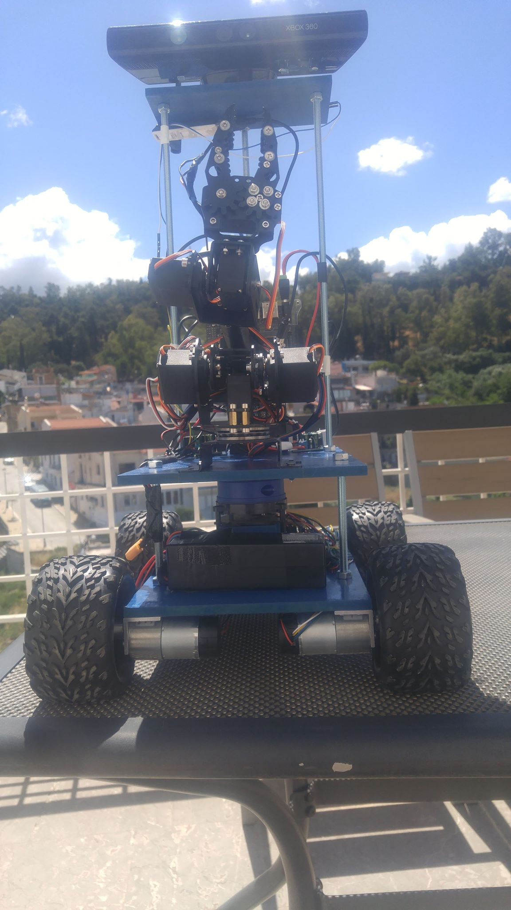
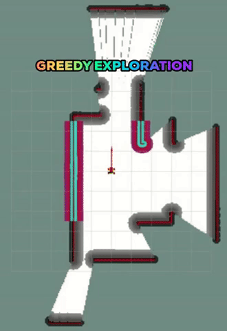
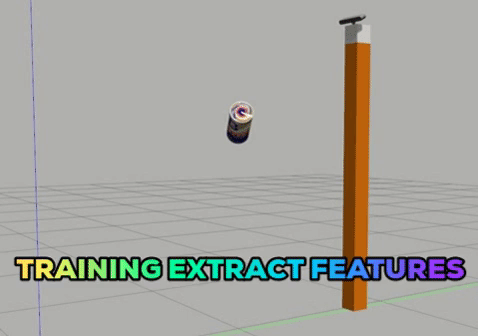
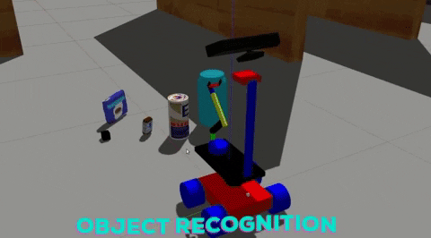
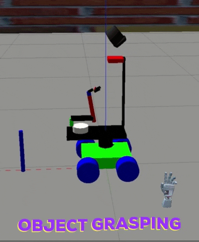
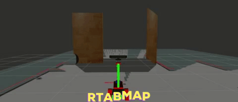
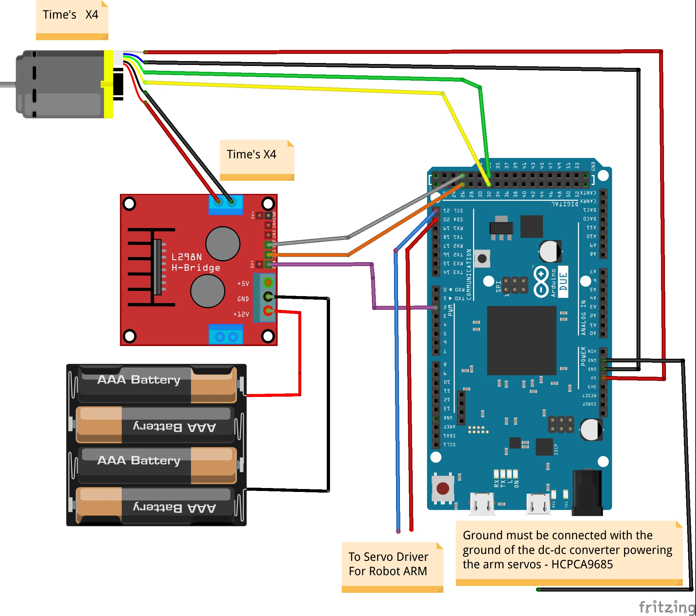
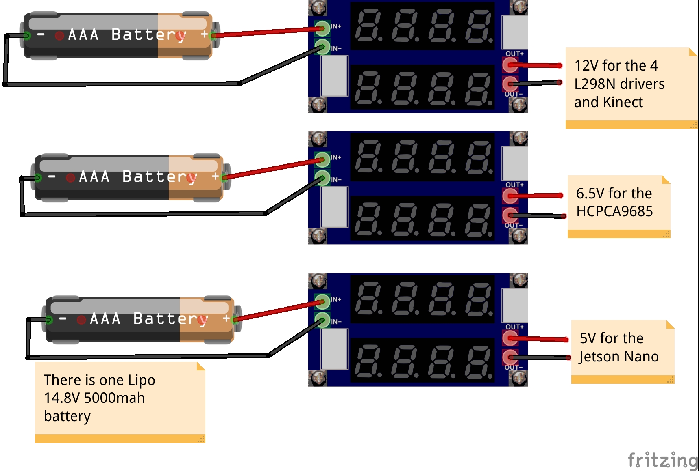

# Open Mobile Manipulator Project

## Description

This project is meant to help you with creating your own **cheap education Mobile Manipulator**, both in simulation and on reality!!

This can help you to learn 

**Moveit, Navigation, Rtabmap, Amcl, Ros Control, hardware interface of a real robot and much more** 

## Branches

**master branch for simulation - Melodic**

**jetson branch for real robot - I use the Jetson Nano - Melodic**

##Some GIFS

### On Simulated robot

**Autonomous SLAM - gmapping - move_base - greedy exploration**

**3D Perception Extract Features - color HSV - Surface Normals in histogram format**

**3D Perception - recognize objects with labels and TF**

**Gazebo Grasping sequence, out of the way**

**RTAB-Mapping in a feaure rich simulated Gazebo world**

### On Real Robot

**Autonomous Navigation - Move_base - AMCL**

**Real Arm Motion**

**3D Mapping my home with RTAB-Map**

**Robot-Kidnap Localization with RTAB-Map**

## Youtube Videos
[**Pick n Place Server w/ 3D Recognition n Moveit Visual Tools - Video**](https://www.youtube.com/watch?v=EEcQfJ2CcUc)

**See how it recognize the object and moves it out of the way!!! It also uses a Pick and Place Server + Client w/ Moveit Visual Tools**

[**Autonomous Navigation - AMCL - Move_Base-  Patrol Node - Video**](https://www.youtube.com/watch?v=d8IMzLhI1tc&t=54s)

**See how it Navigates around my home. The speed is 0.25 linear.x 1.05 linear.z I maybe could push it a little faster but i think it's a decent speed. Fully Integrated with Ros Control Diff Drive Controller**

[**RtabMap - 3D mapping - Localization -Robot Kidnap**](https://www.youtube.com/watch?v=4myLogrLsiE&feature=emb_logo)

**Here you can see the robot mapping a real 3D environment with RTAB-Map and after we have the map in memory it can solve the robot Kidnap localization problem!!!**

## For real robot run the command

**$ roslaunch ommp_bringup real_bringup.launch**

**In order to launch the robot description, controllers - hardware interface, rosserial and sensor drivers**

**ssh -X username@192.168.1.2** (to login in the jetson)

**export ROS_MASTER_URI=**http://mia:11311/ (on the terminal of the pc to run the rviz in the PC)

**maybe export ROS_IP=192.168.1.2 accordingly on the .bashrc of the computer and jetson Nano**

## For simulation

**$ roslaunch ommp_bringup sim_bringup.launch world:=simple robot:=ommp_sim**

**To again launch the robot in the Gazebo alongside the controllers etc..**

**Then you can try for example the following commands**

**$ roslaunch ommp_moveit_interface moveit.launch**

**$ rosrun ommp_moveit_interface set_start_pos.py**

**$ roslaunch ommp_navigation gmapping.launch**

**$ roslaunch ommp_navigation teleop.launch**

## Scripting

**Instead of opening multiple terminals and writing the commands 1 by 1 and then changing the rviz config etc..**

**It is a good practice to use script files to launch automatically multiple terminals with your desired commands by simple running the script**

**Make sure you have installed xterm emulator**

**sudo apt-get update -y**

**sudo apt-get install -y x-terminal-emulator**

**also your scripts (and .py) files have permissions**

**chmod +x safe_spawner_navigation.sh**

**To that end you can go to ( $ roscd safe_spawner ) there you will find some scripts - demos that you can run, for example**

**1. $ ./safe_spawner_rtabmap_basic.sh** to spawn the robot in Gazebo + Moveit + controllers and rviz

**2. $ ./safe_spawner_pseudo_real.sh** to upload the robot description (real) + Ros controller + a dummy hardware interface that assumes perfect execution + moveit. Try to move the robot and arm around. See how you can do that using only RViz without Gazebo.

**3. $ ./safe_spawner_rtabmap_drive.sh** to spawn the robot controllers and rviz and teleop with an interactive marking for twist which doesn't work..

**4. $ ./safe_spawner_navigation.sh** to navigate in a previously known map with amcl and move_base

**5. $ ./safe_spawner_without_map_navigation.sh** to navigate using ONLY move_base without mapping or having a previous map

**6. $ ./safe_spawner_patrol.sh** to navigate in a previously known map with amcl and move_base and a patrol node

**7. $ ./safe_spawner_exploration.sh** to map automatically a new gazebo world with move_base, gmapping and a greedy exploration node

**8. $ ./safe_spawner_frontier_exploration.sh** to map automatically a new gazebo world with move_base, gmapping and the frontier exploration node. Publsih Points in RViz to make a Polygonn the Publish a Point inside the Polygon. The Robot should try to explore the defined area.

**9. $ ./safe_spawner_object_recognition.sh** to spawn the robot in a world with one object that you can recognize, also launches the pick and place server alongside the client press continue in rviz. P.S see 3D Perception Prerequisities

**10. $ ./safe_spawner_rtabmap_mapping.sh** to spawn the robot in a feature rich world in order to perform 3D mapping with teleop commands.

**11. $ ./safe_spawner_rtabmap_localization.sh** to spawn the robot in a feature rich world in order to perform Robot Kidnap Localization. Kidnap the robot in Gazebo -> see RViz jump to correct position. Make sure you have the rtabmap database available at catkin_ws dir. I haven't Included an RTAB-Map databse in the repo due to size limitations

**I will make more of this in the feature**

## One Problem

**I will advice to also run MoveIt and set the arm to a  starting position (That is why in all the scripts we also run MoveIt)**

**Furhtermore, I have made a pitch controller for kinect e.g for object recognition the kinect should look down, see the associated script to see how to move the kinect**

### Jetson Nano problem with kinect?

I had a problem with the Openni driver on the jetson nano which runs ros melodic, i think they have not properly build the driver for arm processors.

To overcome this i used a simple Docker image that you can find on the DockerFile folder inside the data folder. Jetson Nano comes with docker installed otherwise install it. To build the image run from inside the DockerFile dir

**$ docker build -t kinect_image:1.0 .**

Then you can run the image and get the kinect topics with the following command

**$ sudo docker run --net=host --privileged kinect_image:1.0**

## URDF of the robot

**Under the package ommp_description/urdf/robots/ommp_sim/ you can find the main xacro of the robot**

**I tried to make the xacro as easy to modify as possible, in order to quickly set up your costum mobile manipulators P.S I would like to see them**

**On the same dir you can find the common_properties.xacro where are some global variables that are available for all the macros, for example position of the lidar, kinect, arm, size of the robot base etc.**

**On the bases macros you can find the robot_footprint alongside upper level, kinect bases etc**

**On the common_properties there is arg sim, this defines whether we include the gazebo.xacro that are needed on the simulation but not on the real robot, for example ros_control_plugin and gazebo_sensor_macros. Furthermore when we include for example the kinect xacro file this argument get's passed there and this file will decide if it will include the kinect.gazeb0 xacro-plugin and whether it will instantiate this gazebo macro**

## 3D Perception

**Step 1 : Training - Extract Features**

**$ roslaunch sensor_stick training.launch**

This will launch  a simple Gazebo world with sensor stick and an RGB camera

Then you can run the capture features node which will spawn the objects in random orientations and extract the features (hsv and surface normals histograms), when this node is done it will output a training_set.sav file.

**$ rosrun sensor_stick capture_features.py**

Have a look at this node, more orientations the better, you can add your own models at sensor_stick/models  directory put at your bashrc the following 

export GAZEBO_MODEL_PATH=~/catkin_ws/src/Open_Mobile_Manipulator/sensor_stick/models:$GAZEBO_MODEL_PATH

P.S you can also download the osrf gazebo models (optional)

**Step 2: Train the SVM classifier**

Then with the training_set.sav file ready we are ready to train our SVM classifier. Run the node

**$ rosrun sensor_stick train_svm.py**

Make sure, the training_set.sav is in a location that pickle can read.
It will output a model.sav file containing the classifier.

**Step 3 : Run the object recognition pipeline e.g pcl preprocessing (downsampling, crop, outlier removal - RANSAC plane removal) -> (segmantation Eucledian clustering) -> Use the classifier to classify the sub-point clouds -> Publish TF and labels**

**$ roslaunch sensor_stick object_recognition.launch**

**P.S for a demo you can also run the associated script, (I have arleady pretained a classifier - model.sav file)**

**P.S In order to run the 3D Perception you should be able to import pcl and sklearn in python2 see below on how to do that**

Then you will see your object recognized with labels on RVIZ and associating TF's

## Ros_control Hardware Interface

I used this repo of  [**PickNikRobotics**](https://github.com/PickNikRobotics/ros_control_boilerplate) , I should have forked but this is complicated :)

If you want follow the instructions on this repo, to rename the ommp_control to your liking. It is made into a library format e.g genecric_hardware_interface, generic_control_loop. Then inside ommp_control you include this library, inherit and you write your read() and write() functions. See the code that Dave Coleman developed it is a nice package to learn hardware interfaces and ros code in general.

Because my arm doesn't have feedback on the read and write i just pass the position_command_interface into the joint_state_interface, this is to say we assume perfect execution.

This also has the effect that the robot-rviz (meaning what the robot thinks), thinks that the arm is moving (joint_states), whether you have the real arm connected or not (you can see it moving in rviz).

**Run the ./safe_spawner_pseudo_real.sh script for a demo of this, alongside a dummy passthrough velocity interface for the wheels**

**Furthermore i have included in the Hardware Interface a Publisher and Subscriber to communicate with the Arduino rosserial, but on the simulation branch in the read() and write() i have commented out the .publish methods and i used the dummy passthrough perfect execution instead**

After that in the real robot arm i used a node that subscribes to the joint_states, transforms them into appropiate servo commands and sends them to **PCA9685 ros driver** for execution in a Multiarray message. You can find this node at ommp_bringup/src/pub_to_arduino_class.cpp

Meaning that the arm is a "clone" of the joint_states. Furthermore, on the pub_to_arduino code there is a call activate_arm if you publish an integer on this topic, it will activate the servos in a predefined position. If you move the arm with MoveIt to this location before you activate the servos to this position, then when you activate the servos your arm will be synchronized!!! and can safely clone the Joint States without sudden movements.

Lastly on the real robot we use the Publisher and Subscriber of the Hardware Interface to send appropiate Set Velocity targets to the Arduino and recieve the Encoder Feedback, after we transform them a Little. Here we don't assume perfect execution like we do for the Servos. This way our robot is fully integrated with the ros_control Diff_Drive_Controller

**See in the ommp_control/config/hardware_interface.yaml how to configure the hardware Interface , I have noticed that with echo joint_states the order of the joints is alphabetically, and in the config you should place them in the same order.**

### PCA9685 Driver

**This is a [**PCA9685 ros driver**](https://discourse.ros.org/t/new-pca9685-driver-for-ros/8299) that you can use directly with ROS and Jetson Nano to avoid the Arduino middleware developed by dheera, i have included this driver in the extra packages at least in the jetson branch. Make sure you have the I2C in the usergroup see the docs. Furthermore i think it has a small bug that if you publish the same command it will deactivate the servos, so if the joint_states doesn't change i do a +- 1 trick to keep this from happening**

## Compiling

**mkdir -p ~/catkin_ws/src && cd catkin_ws/src**

**git clone** https://github.com/panagelak/Open_Mobile_Manipulator.git

**cd ~/catkin_ws**

**rosdep install --from-paths src --ignore-src -r -y** (install depedencies)

**catkin_make sometimes doesn't work so build with catkin build**
**install it from [**install catkin tools**](https://catkin-tools.readthedocs.io/en/latest/installing.html) 

**catkin build -DCMAKE_EXPORT_COMPILE_COMMANDS=1**

**Now theoritically it should be easy to compile the project in ROS Melodic**

**P.S In the extra packages i have put some packages developed either by me or by other e.g m-explore (greedy) and frontier exploration. I know that is not the best practice to include packages like this because you will not recieve any updates e.t.c but at least it is easier to install and you will have a working version of this packages compatible with my repo P.S (I also had to remove their gits sorry :) )**

### 3D Perception Installation

**The sensor_stick package is responsible for the 3D Perception, it is a mod of the Udacity's 3D Perception Project compatible with my repo and slightly simplified. It should compile fine, but in order to execute you should be able to IMPORT pcl and sklearn in python 2**

**Go to this package [RoboND-Install-PCL](https://github.com/udacity/RoboND-Perception-Exercises) clone in a different folder and follow the instruction there in order to install pcl**

**For sklearn i put in the package.xml this <run_depend>python-sklearn</run_depend> I hope it works but i have not tested in clean system**

## Arduino Due

**I Advice to use an Arduino Due because it is a lot faster, not so expensive, and all the pins can be used to read encoders**

**Also i believe it is the cheaper and easier way to read 4 quadrature encoders directly w/ pid without extra harware and shields on top of rosserial, also in order for Arduino Due to work with rosserial add this line on the top of your scetch #define USE_USBCON**

Download Arduino IDE then download in the board manager the board for the due

Programming port - Arduino due , port devttyACM0 -> Upload the arduino code

**sudo usermod -a -G dialout $USER** restart

**The Arduino libraries i used, that you should copy paste on your arduino scetch folder Are:** 

 [**rosserial**](http://wiki.ros.org/rosserial_arduino/Tutorials/Arduino%20IDE%20Setup)

[**Encoder Library**](https://github.com/PaulStoffregen/Encoder)

[**PID Library**](https://playground.arduino.cc/Code/PIDLibrary/)

## List of materials
[Geared dc motor x4](https://www.amazon.co.uk/gp/product/B07D95B68J/ref=ppx_yo_dt_b_asin_title_o00_s00?ie=UTF8&psc=1)

**I Used these motors w/ encoders Geared 83 rpm, you can go higher in the rpm's if you want but make sure they have enough power**

[arm 6 dof amazon uk](https://www.amazon.co.uk/gp/product/B07VYHFL1V/ref=ppx_yo_dt_b_asin_title_o01_s00?ie=UTF8&psc=1)

Jetson Nano ~ 100

Arduino Due ~ 30

4 L298N motor driver

3 DC-DC buck converters

2D ydlidar ~ 100

1 Kinect - or an Intel realsense 3D camera - whatever you want!!

1 lipo 5000 mah battery ~ 50

1 usb wifi anttena

1 16-bit Adafruit servo shield I2c or HCPCA9685

**The total cost should be approximately 500 - 700 - 1000 euro**

## Robot Base

The robot base will consist of two levels of wood e.g 31.8x20x0.8 cm.

In the underside of the lower level put 4 dc motor brackets, 4 dc motor and the 4 L298N motor drivers and make holes for the cables.

Make 8mm holes to pass through metal rods and nuts (maybe put glue too to secure the nuts), be carefull on how you do that.

In the lower level put the lidar **elevated** maybe with 6 small pieces of wood 5x7x0.8cm, glue them and double side tape the lidar in place, also the arduino due and battery

In the upper level (10cm over the down level) place the 3 DC-DC buck converters and Jetson Nano, arm

e.g You can make an elevated platform for kinect (40cm over the upper level with 3 extra metal rods. (1 metal rod runs through all the levels)

**You can see some close up photos in the data folder -> mm_photos, but i should make clearer instructions some time or email me for further details**

**BE CREATIVE**

## Diploma

**In this [repo](https://github.com/panagelak/diplomatiki_temp) you can find my Diploma there you can find a lot of theory and some experimental results on the appendix!!!**

## Presentation

**In this [repo](https://github.com/panagelak/Presentation_Mobile_Manipulator) you can find my presentation for the Mobile Manipulator. It is written in LibreImpress HIT PLAY AND ENJOY**

## Contact ME

**You can contact me at panagelak12@gmail.com or panagiotis.angelakis.robot@gmail.com**

**For more assembly details or questions**

**I will be happy to answer your questions don't be afraid!!!**

**Cheers**

**ppy to answer your questions don't be afraid!!!**

**Cheers**

**