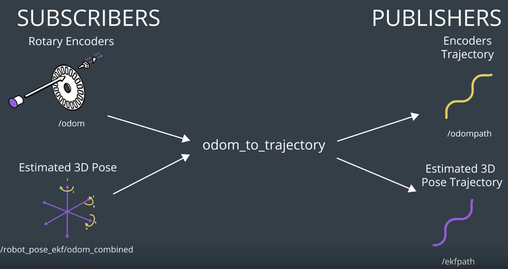

[](https://www.udacity.com/robotics)

# odom_to_trajectory
A ROS Package that subscribes to odometry values and publishes trajectories. This package will append the odometry values generated over time into vector of values. 

### Nodes
The package contains two nodes
1. **path_odom_plotter**: Subscribes to 2D unfiltered odometry, appends the robot last 1000 poses, and publishes the robot unfiltered trajectory.
      * Script File: path_odom_plotter.py
      * Subscriber: "/odom"
      * Publisher: "/odompath"
2. **path_ekf_plotter**: Subscribes to 3D filtered odometry, appends the robot last 1000 poses, and publishes the robot filtered trajectory.
      * Script File: path_ekf_plotter.py
      * Subscriber: "/robot_pose_ekf/odom_combined"
      * Publisher: "/ekfpath"


      
### Steps to launch the nodes
#### Step1: Install the package
```sh
$ cd /home/workspace/catkin_ws/src
$ git clone https://github.com/udacity/odom_to_trajectory
```
#### Step2: Build the package
```sh
$ cd /home/workspace/catkin_ws
$ catkin_make
$ source devel/setup.bash
```
#### Step3: Launch the nodes
```sh
$ roslaunch odom_to_trajectory create_trajectory.launch
```
